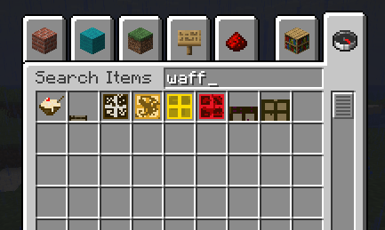
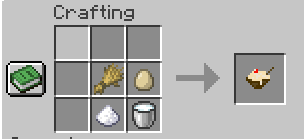
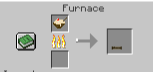
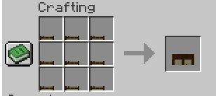
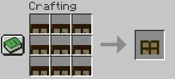

# Waffles Mod

Eat a lot of different waffles and never run out of hunger.

---

## Items

- **Batter Mix**
- **Waffle**
- **Flavored Waffles**
  - **Chocolate Waffle**
  - **Glow Berry Waffle**
  - **Golden Waffle**
  - **Sweet Berry Waffle**
  - **Placeable Waffle Blocks**
  - **Waffle Block**
  - **Big Waffle**

---

## Recipes 

### 1. Batter Mix

---

### 2. Baking Waffles

---

### 3. Flavored Waffles 

Following table helps crafting the flavoured waffles:

| Flavor | Recipe | Result |
| :--- | :--- | :--- |
| **Chocolate Waffle** | `1× Waffle` + `1× Cocoa Beans` | 1× Chocolate Waffle |
| **Glow Berry Waffle** | `1× Waffle` + `1× Glow Berries` | 1× Glow Berry Waffle |
| **Golden Waffle** | `1× Waffle` + `1× Gold Ingot` | 1× Golden Waffle *yum yum and expensive* |
| **Sweet Berry Waffle** | `1× Waffle` + `1× Sweet Berries` | 1× Sweet Berry Waffle |

---

### 4. Waffle Blocks & Big Waffle

#### **Waffle Block**
Crafted in a 3×3 grid using 9 Waffles. GIVES 60 HUNGER POINTS!

#### **Big Waffle**
Crafted in a 3×3 grid using 9 Waffle Blocks! GIVES 600 HUNGER POINTS!! Enough to Last Forever!!!

---

## Advancements

- **Batter Up!**: Craft your first bowl of Batter Mix.
- **Iron Chef**: Cook a Waffle in a Furnace, Smoker, or Campfire.

---

#### The compiled mod `.jar` will be available in `build/libs/`.
